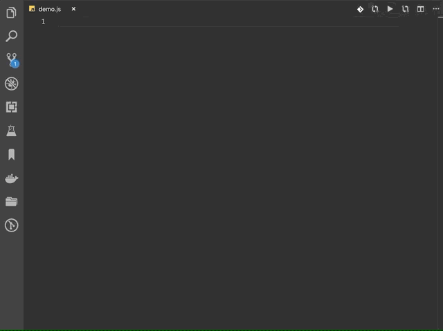

# my vscode user ssnippets for javascript

## example

```json
{
  "Print to console": {
    "prefix": "log",
    "body": [
      "console.log('$1');",
      "$2"
    ],
    "description": "Log output to console"
  }
}
```

## async-init



```json
{
  "async-init": {
    "prefix": "async-init",
    "body": [
      "(async () => {",
      "    ",
      "})()"
    ],
    "description": "async init"
  }
}
```
